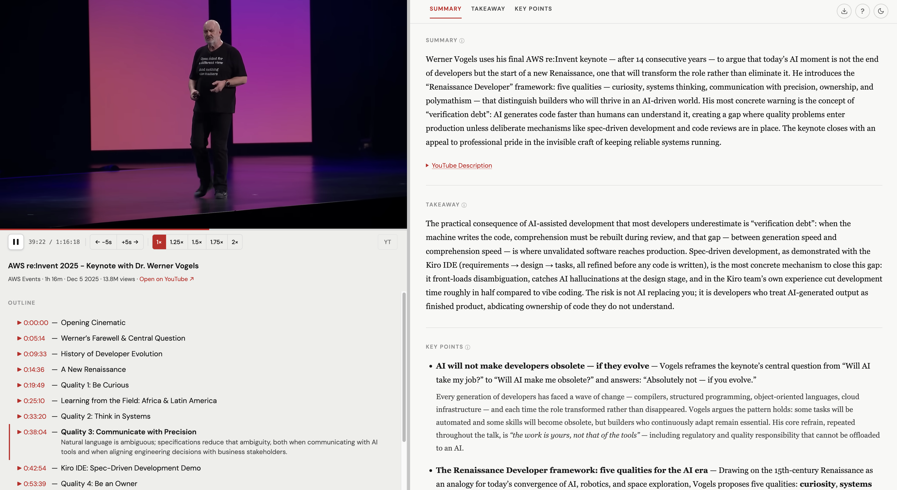

# video-lens

**Turn any YouTube video into a polished research report.**

> **Windows-native fork** of [kar2phi/video-lens](https://github.com/kar2phi/video-lens). Runs in Claude Code (and other SKILL.md agents) on Windows via Git Bash with **no manual environment tweaks** — the scripts force UTF-8 I/O and invoke yt-dlp as a Python module, so the legacy `cp1252` crash and the "yt-dlp not on PATH" failure are gone. macOS/Linux behaviour is unchanged. See [Install on Windows](#install-on-windows).

video-lens is a coding agent skill that fetches a YouTube transcript and generates a structured HTML report — executive summary, takeaway, key points with analysis, timestamped topic outline, and an embedded in-page player.



---

## What you get

- **Executive summary** — 3–5 sentence TL;DR overview
- **Takeaway** — the single most important insight (1–3 sentences)
- **Key points** — bulleted, scannable insights with supporting detail
- **Timestamped outline** — click topics to expand summaries; click timestamps to jump the player
- **Full transcript** — the complete transcript in its own section, grouped into readable passages with clickable timestamps (and included in the Markdown export)
- **In-page YouTube player** — watch while reading; auto-highlights the current section
- **Local transcription fallback** — when captions are unavailable, transcribe audio locally with Whisper
- **Keyboard shortcuts** — playback speed, layout resize (S/M/L), navigation, and more (`?` for help)
- **Markdown export** — copy the full report as Markdown in one click
- **Dark mode** — auto-detects system preference; remembered across sessions
- **Video gallery** — browse, search, and filter all your saved reports by title, channel, tag, or keyword; shows thumbnails, summaries, and tags at a glance

---

## Requirements

| Tool                                             | Purpose                                                    |
| ------------------------------------------------ | ---------------------------------------------------------- |
| A supported coding agent                         | Runs the skill (see [Supported Agents](#supported-agents)) |
| Python 3                                         | Runs the helper scripts                                    |
| `youtube-transcript-api`                         | Fetches YouTube captions/subtitles                         |
| `yt-dlp`                                         | Fetches metadata and downloads audio for local transcription |
| **Optional:** [Raycast](https://www.raycast.com) | Trigger from anywhere via hotkey (macOS)                   |
| **Optional:** [Task](https://taskfile.dev)       | Install/dev commands alias (`brew install go-task`)        |
| **Optional:** [Deno](https://deno.com)           | Used by yt-dlp only for edge-case extractors (`brew install deno`) |
| **Optional:** `mlx-whisper` + `ffmpeg`           | Local Whisper fallback for videos without captions (Apple Silicon) |

> **Note:** video-lens first tries YouTube captions/subtitles. If captions are missing or blocked, it can fall back to local Whisper transcription when the optional local dependencies are installed. YouTube Shorts are not supported.

---

## Supported Agents

video-lens uses the universal [SKILL.md](https://agents.md/) format — any agent that supports it can run this skill.

[](https://skills.sh/kar2phi/video-lens)

---

## Install

### Install on Windows

The fastest path on Windows (PowerShell):

```powershell
git clone https://github.com/LeveL7LLC/video-lens-windows.git
cd video-lens-windows
pwsh -File install.ps1            # add -Agent gemini|cursor|copilot|… for other agents
```

`install.ps1` ensures a working `python3` command (creating a shim if your Python only exposes `python`), installs the Python dependencies, and copies both skills into `~/.claude/skills`. Then run `/video-lens <url>` in your agent.

Prefer to do it by hand? Install the deps and copy the two skill folders:

```powershell
python -m pip install youtube-transcript-api yt-dlp
Copy-Item skills\video-lens         "$HOME\.claude\skills\video-lens"         -Recurse -Force
Copy-Item skills\video-lens-gallery "$HOME\.claude\skills\video-lens-gallery" -Recurse -Force
```

If `python3` doesn't run on your machine (it prints a Microsoft Store message), `install.ps1` handles it — or copy your interpreter once: `Copy-Item (Get-Command python).Source "<a dir on PATH>\python3.exe"`.

> The macOS-first options below (`npx skills add kar2phi/video-lens`, Raycast, `task …`) target the **upstream** repo and are not used for the Windows install. Raycast and the local Whisper fallback (`mlx-whisper`) are macOS / Apple-Silicon only.

### Option A — skills CLI (recommended)

```bash
npx skills add kar2phi/video-lens
pip install youtube-transcript-api yt-dlp

# Optional: local transcription fallback on Apple Silicon
pip install mlx-whisper
brew install ffmpeg

brew install deno  # optional; only needed if yt-dlp fails on certain videos
```

Then use `/video-lens <url>` in any supported agent.

### Option B — Manual install (clone + Task)

Clone the repo and use `task install-skill-local` to copy the skill (prompt, template, and scripts) to a specific agent dir:

```bash
git clone https://github.com/kar2phi/video-lens.git
cd video-lens
task install-skill-local AGENT=claude   # or copilot, gemini, cursor, …
pip install -r requirements.txt

# Optional: local transcription fallback on Apple Silicon
pip install mlx-whisper
brew install ffmpeg
```

`task install-skill-local` deploys all files in `skills/video-lens/` (including `scripts/`) — a plain curl of individual files won't pull the script set and the skill will fail at runtime.

### Option C — Full install (with Raycast + dev tools)

#### 1. Clone and install Python dependencies

```bash
git clone https://github.com/kar2phi/video-lens.git
cd video-lens
task install-libraries

# Optional: local transcription fallback on Apple Silicon
pip install mlx-whisper
brew install ffmpeg

# Optional: only needed if yt-dlp fails on certain videos
brew install deno
```

#### 2. Install the skill

```bash
task install-skill-local
```

#### 3. (Optional) Install the Raycast script for Claude

```bash
task install-raycast AGENT=claude
```

Requires Raycast. The script opens a new iTerm2 tab (or Terminal.app if iTerm2 isn't installed), launches Claude with the required permissions, and runs the skill.

---

## Usage

### In Claude Code

```
/video-lens https://www.youtube.com/watch?v=...
```

Claude fetches the transcript, generates the report, and opens it in your browser at `http://localhost:8765/`.

If captions are unavailable, video-lens can ask to run local transcription instead. The fallback downloads the video's audio with `yt-dlp`, transcribes it with `mlx-whisper`, and then generates the same report format. It is slower than captions and may download a Whisper model the first time it runs.

### Gallery

Browse, search, and filter all your saved reports by title, channel, tag, or keyword:


After generating reports, open the gallery:

```
/video-lens-gallery
```

Or rebuild the index manually:

```bash
task build-index
```

The gallery opens at `~/Downloads/video-lens/index.html`.

### Via Raycast

Invoke the **video-lens** command, paste a YouTube URL (or leave blank to use the clipboard), and choose a model (default: Sonnet). The report opens automatically in your browser.

Reports are saved to `~/Downloads/video-lens/reports/`.

---

## Dev server

To iterate on `skills/video-lens/template.html` without running a real video:

```bash
task dev
```

Opens a rendered sample report at `http://localhost:8765/sample_output.html`.

---

## Repo layout

```
video-lens/
  skills/
    video-lens/
      SKILL.md          ← skill prompt (source of truth)
      template.html     ← HTML report template (source of truth)
      scripts/
        fetch_transcript.py
        fetch_metadata.py
        preflight.py
        render_report.py
        serve_report.sh
        transcribe_local.py ← local Whisper fallback (optional deps: mlx-whisper + ffmpeg)
    video-lens-gallery/
      SKILL.md          ← gallery skill prompt (source of truth)
      index.html        ← gallery viewer (source of truth)
      scripts/
        backfill_meta.py  ← backfills meta blocks into old reports
        build_index.py    ← builds manifest.json and copies index.html
  scripts/
    raycast-video-lens.sh ← Raycast script (source of truth)
    yt_template_dev.py← Dev server helper
  Taskfile.yml
  requirements.txt
```

**Always edit files in this repo, then deploy with `task install-skill-local AGENT=claude` and `task install-raycast AGENT=claude`.** Never edit directly in `~/.{agent}/skills/` or `~/.raycast/scripts/`.

---

## Contributing

PRs welcome. Keep the skill prompt in `skills/video-lens/SKILL.md` and the HTML template in `skills/video-lens/template.html` — those are the sources of truth.

## License

MIT
